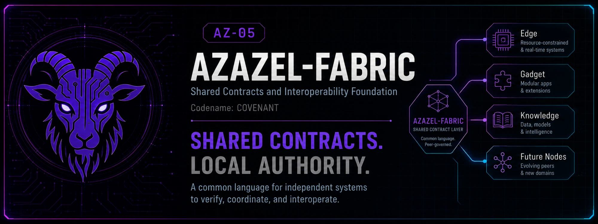

# AZ-05 Azazel-Fabric - Shared Contracts and Interoperability Foundation

> **Codename:** `COVENANT`



Shared contracts and interoperability foundation for the Azazel System.

> Formal series name **Azazel-Fabric Contract** (**AZ-05**), ratified
> 2026-07-10; formerly **Azazel-Common**. The codename `COVENANT` follows the
> series convention (Edge: `SENTINEL`, Gadget: `TACMOD`, Deception: `THEATRE`):
> the binding agreement the series' products sign — used for changelogs and
> release names, never formal external naming.

Thin, shared contract package for the Azazel series (`Azazel-Edge`,
`Azazel-Gadget`, `Azazel-Knowledge`, `Azazel-Deception`, and future tools such
as `Azazel-Boot`).

Azazel-Fabric is not the decision core of any Azazel product. It is the
series' common language. Each product's own judgment stays in its own
repository: Edge owns deterministic decisions and enforcement, Knowledge
analyzes/advises, Gadget owns its local mode control, and Deception
materializes only Edge-approved environments.

## Status

**Latest stable release: `v0.4.0`.**

**`main`: `0.5.0.dev0` — unreleased AZ-06 deception-environment contracts.**
The development contract family is additive and is being exercised by
Azazel-Deception and Azazel-Edge through an exact commit pin before a tagged
release is cut.

Stable `v0.4.0` ships:

- `azazel_fabric.schema` / `azazel_fabric.cti_contracts` — shared schema and advisory-only CTI contract.
- `azazel_fabric.view` — shared `StatusView` view model.
- `azazel_fabric.paths` — non-authoritative candidate-path hints and dry-run migration planning.
- `azazel_fabric.audit` — shared `AuditEvent` projection and JSONL formatters.
- `azazel_fabric.api` — framework-neutral fail-closed API helpers.
- `azazel_fabric.notify` — notification payloads/mappers; no network send.
- `azazel_fabric.testing` — shared factories and invariant assertions.

Development `0.5.0.dev0` additionally provides
`azazel_fabric.deception_contracts`:

- `DeceptionPackage`, `NarrativeManifest`, `NarrativeConsistencyReport`
- `HostCapabilities`, `RuntimeRequirements`, `DeploymentTier`
- `ImageManifest`, per-platform OCI digests, provenance/SBOM references
- `PlacementPlan` with explicit `descriptive_only` authority
- Edge-owned activation/transition/termination decision contracts
- environment event/outcome contracts
- static rejection of directive-bearing Fabric payloads
- unrepresentable unrestricted egress/production access in the canonical safety model

See [`docs/deception-contracts.md`](docs/deception-contracts.md).

## Consumer status

| Product | Current status |
|---|---|
| Azazel-Edge (AZ-01) | Shipping Fabric integration; AZ-06 shadow/replay tests currently pin the exact `0.5.0.dev0` contract commit. Fabric remains optional for baseline Edge runtime. |
| Azazel-Gadget (AZ-02) | Shipping Fabric integration; current Gadget documentation reports `azazel-fabric` v0.4.0 for StatusView. AZ-06 compatibility remains a constrained future `gadget-lite` subset. |
| Azazel-Knowledge (AZ-04) | Adopted at the API boundary with `azazel_fabric.cti_contracts` v0.3.0; core remains dependency-minimal and advisory-only. |
| Azazel-Deception (AZ-06) | Active development consumer of the exact `0.5.0.dev0` contract commit for canonical package/capability/placement models; live exposure remains disabled by default. |

Consumer pins must be reconciled again when `v0.5.x` is tagged. Development
commit pins must not be presented as stable releases.

## Install

Stable consumers should use the latest compatible exact tag, currently:

```bash
pip install "azazel-fabric @ git+https://github.com/01rabbit/Azazel-Fabric.git@v0.4.0"
```

Development consumers that require the unreleased AZ-06 contracts use an
**exact reviewed commit**, never `main`, until a matching `v0.5.x` release is
published.

Consumers pin an exact tag for field deployment (see
[`docs/design-principles.md`](docs/design-principles.md) §6).

```python
from azazel_fabric.schema import StateSnapshot, DecisionExplanation
from azazel_fabric.cti_contracts import CtiContextResponse
from azazel_fabric.deception_contracts import (
    DeceptionPackage,
    HostCapabilities,
    PlacementPlan,
    EnvironmentActivationDecision,
)
from azazel_fabric.view import StatusView, build_status_view
from azazel_fabric.api import error_payload, role_allows, extract_token
from azazel_fabric.notify import NotificationEvent, to_ntfy_payload
from azazel_fabric.paths import candidate_runtime_dirs, plan_migration
from azazel_fabric.audit import project_audit_event, to_jsonl_line
from azazel_fabric.testing import make_status_view, assert_advisory_only
```

Adopting Fabric in a new series product? Start with the
[day-1 adoption guide](docs/adoption-guide.md).

## Authority rule for AZ-06

> Fabric describes. Edge decides and enforces. Deception Host materializes,
> transitions, records, and resets. Knowledge analyzes and advises.

Capability reports, packages, placement plans, and advisories never grant
activation authority. In the initial architecture only an explicit,
unexpired Azazel-Edge decision may authorize an AZ-06 live runtime change.

## Versioning

Version management is tag-driven on GitHub. The single source of truth is
`src/azazel_fabric/version.py`; each stable release is a `vX.Y.Z` git tag plus
a matching GitHub Release. A `.dev0` value on `main` is explicitly unreleased.
The Release workflow validates that a pushed tag matches the packaged version
and runs the test suite before publishing.

## Documentation

| Document | Contents |
|---|---|
| [`docs/architecture.md`](docs/architecture.md) | Azazel-Fabric's position in the series and responsibility boundaries |
| [`docs/design-principles.md`](docs/design-principles.md) | What goes in Fabric vs. what never does, and why |
| [`docs/contracts.md`](docs/contracts.md) | Stable shared schema and Edge/Gadget ↔ CTI contracts |
| [`docs/deception-contracts.md`](docs/deception-contracts.md) | Unreleased `0.5.0.dev0` AZ-06 contract family, authority and migration rules |
| [`docs/adoption-guide.md`](docs/adoption-guide.md) | Day-1 adoption playbook for a series product |
| [`docs/migration-plan.md`](docs/migration-plan.md) | Phased, additive, reversible rollout plan |
| [`docs/repository-layout.md`](docs/repository-layout.md) | Package layout |
| [`docs/issue-breakdown.md`](docs/issue-breakdown.md) | GitHub implementation work |

## License

MIT. See [`LICENSE`](LICENSE).
